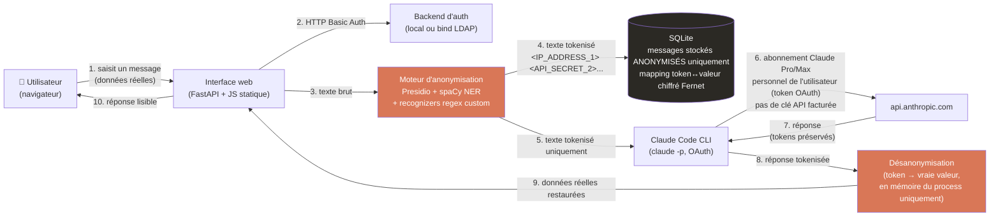

<p align="center">
  
</p>

<h1 align="center">TokenVeil</h1>

**Statut : Alpha (build de test interne) — dépôt vitrine public**

Une interface de chat auto-hébergée pour Claude qui anonymise automatiquement les données sensibles (PII, IP internes, clés API/secrets, références clients, IBAN, numéros de carte bancaire...) avant qu'elles n'atteignent Claude, et restaure de façon transparente les vraies valeurs dans la réponse affichée à l'utilisateur. Les données réelles ne quittent jamais votre infrastructure.

> **Ceci est une copie vitrine.** Tout ici est du vrai code de prod (auth, système de licence, frontend, déploiement Docker) sauf `anon_engine.py` — le moteur de détection/anonymisation réel — remplacé par un stub respectant son interface publique. Voir [ARCHITECTURE.md](ARCHITECTURE.md) §4 pour ce qu'il fait sans exposer comment. Code source complet disponible sous licence commerciale : [marc.bourrel81@gmail.com](mailto:marc.bourrel81@gmail.com).

> Non affilié à, ni approuvé ni sponsorisé par Anthropic ou Google. "Claude" est une marque déposée d'Anthropic PBC, "Gemini" une marque de Google LLC. Ce projet est un client indépendant qui utilise ces modèles via l'abonnement/accès API propre de chaque utilisateur.

## Licence

Code source disponible sous [Elastic License 2.0](LICENSE). Tu peux le lire, l'auditer, l'auto-héberger. Tu ne peux **pas** : le proposer en service hébergé/managé à des tiers, ni contourner/désactiver le système de licence. Pour une licence commerciale de déploiement, contacte [marc.bourrel81@gmail.com](mailto:marc.bourrel81@gmail.com).

> 🇬🇧 English version: [README.md](README.md)

---

## 1. Le problème

Les équipes collent des données de production réelles dans des outils de chat IA au quotidien — logs avec IP internes, clés API qui fuitent, noms de clients, références de tickets, données financières. Ces données partent ensuite chez un fournisseur de modèle tiers, sont stockées de son côté, et potentiellement utilisées pour l'entraînement ou conservées dans des logs.

**TokenVeil** s'intercale entre votre équipe et Claude : il retire tout ce qui est sensible *avant* que la requête ne quitte votre serveur, et le remet *après* réception de la réponse. Du point de vue de l'utilisateur, rien ne change — il colle un vrai log, il reçoit une vraie réponse exploitable. Claude lui-même ne voit que des placeholders opaques comme `<IP_ADDRESS_1>`, `<API_SECRET_2>`, `<CUSTOMER_REF_3>`.

## 2. Fonctionnement



**Point clé : les vraies valeurs ne traversent jamais la frontière réseau vers Claude.** La tokenisation se fait côté serveur, en mémoire, avant l'appel sortant. La détokenisation se fait après réception de la réponse, également en mémoire. L'API Anthropic ne voit que les étapes 5 à 7 : texte tokenisé en entrée, texte tokenisé en sortie.

### Facturation par utilisateur (pas de clé API partagée)

Chaque utilisateur lie **son propre** abonnement Claude Pro/Max via un flow OAuth intégré à l'UI (page Profil → "Lier mon compte Claude"). Le backend pilote `claude setup-token` (commande officielle du CLI Claude Code) via un pseudo-terminal, capture le token OAuth longue durée généré, et le stocke chiffré (Fernet) sur disque, isolé par utilisateur (`CLAUDE_CONFIG_DIR` par username). Chaque prompt de cet utilisateur est ensuite exécuté via le CLI Claude Code authentifié avec son propre token — **facturé sur son abonnement personnel, pas sur une clé API partagée et facturée au token.**

### Ce qui est détecté et anonymisé

| Catégorie | Exemples |
|---|---|
| Réseau | Adresses IPv4, adresses MAC, hostnames internes (`.local`, `.corp`, `.lan`...) |
| Identité | Noms de personnes, emails, téléphones, champs de logs type `user=`/`login=`/`owner=` |
| Secrets | Clés API, tokens, mots de passe, bearer tokens (`apikey=...`, `token: ...`), chaînes hex/base64 haute-entropie |
| Financier | IBAN, numéros de carte bancaire |
| Références métier | Références client/ticket/employé (`CUST-1234`, `TICKET-5678`...) |
| NER générique | Organisations, lieux, US SSN (via spaCy, FR + EN) |

La détection combine :
- **Les recognizers natifs de Presidio** (basés NER, via spaCy `fr_core_news_lg` / `en_core_web_lg`)
- **Des recognizers regex custom** calibrés pour les formats techniques/logs que le NER générique rate (clés API brutes, IP dans des URLs, IBAN sans validation de checksum qui fuiteraient sinon sur une faute de frappe, etc.)
- **Une résolution des chevauchements** qui priorise les patterns custom à haute confiance face aux suppositions du NER générique, avec un traitement ligne par ligne pour empêcher qu'une entité ne déborde d'une ligne de log à l'autre.

### Transparence en temps réel

L'UI affiche, en temps réel pendant la frappe, exactement ce qui serait envoyé à Claude sous forme anonymisée (aperçu avec léger délai). Chaque message envoyé dispose aussi d'un bouton "Voir la version envoyée à Claude" qui révèle le payload tokenisé réellement sorti du serveur — rien n'est caché à l'utilisateur final sur ce que fait concrètement l'anonymisation.

## 3. Données au repos

- **Table des conversations** : ne stocke que la version *anonymisée* de chaque message. Le texte réel n'est jamais persisté en clair.
- **Mapping token ↔ valeur** : stocké par conversation, chiffré au repos avec Fernet (symétrique, clé issue de la variable d'env `ANON_DB_KEY`). Déchiffré uniquement en mémoire, à la demande, pour afficher la vue désanonymisée au propriétaire authentifié.
- **Tokens OAuth** : stockés par utilisateur, chiffrés Fernet, permissions fichier `600`, jamais loggés, jamais envoyés ailleurs qu'en variable d'environnement au process local `claude`.

## 4. Authentification

- `AUTH_BACKEND=local` : un seul compte partagé utilisateur/mot de passe via `.env` (suffisant pour un test alpha rapide).
- `AUTH_BACKEND=ldap` : bind+search contre votre LDAP/Active Directory existant. Supporte recherche puis bind via compte de service (compatible AD) ou DN templaté directement, plus restriction optionnelle par appartenance à un groupe (`LDAP_REQUIRE_GROUP_DN`).

C'est la fondation du modèle multi-utilisateur cible : les employés s'authentifient via le LDAP existant de l'entreprise, puis chacun lie une fois son propre abonnement Claude Pro/Max, depuis l'UI.

## 5. Installation

### 5.1 Docker (recommandé pour un déploiement client)

```bash
cp .env.example .env
# renseigner ANON_DB_KEY (généré avec la commande en commentaire dans le fichier),
# AUTH_BACKEND, WEBAPP_USERS (ou LDAP_*)

docker compose up -d --build
```

L'image embarque tout : Python, modèles spaCy fr/en, Node.js et le CLI Claude Code (`claude`).
Premier build long (~1 Go de modèles NLP à télécharger), les suivants sont rapides grâce au cache Docker.

**Le dossier `./data` est le seul état à sauvegarder** : base SQLite (conversations, mapping chiffré),
comptes Claude/Gemini liés par utilisateur. Il est monté en volume, donc un `docker compose up --build`
pour mettre à jour le code ne touche jamais ces données. Pas de backup = perte des liaisons de compte
et de l'historique en cas de suppression du conteneur.

Vérifier que ça tourne :
```bash
curl http://localhost:8500/healthz   # {"status": "ok"}
```

### 5.2 Sans Docker (dev local)

```bash
python3 -m venv venv
source venv/bin/activate
pip install -r requirements.txt

cp .env.example .env   # renseigner WEBAPP_USER / WEBAPP_PASSWORD / ANON_DB_KEY / AUTH_BACKEND
uvicorn app:app --host 0.0.0.0 --port 8500
```

Prérequis dans ce cas : `claude` (Claude Code CLI) installé et dans le `PATH` à la main (l'image Docker
s'en occupe automatiquement). Chaque utilisateur lie son propre abonnement depuis le panneau
**Préférences** de l'UI — aucune clé API n'est nécessaire dans la config pour Claude ; Gemini se lie via
une clé API personnelle (aistudio.google.com), gratuite sur les modèles Flash.

## 6. Stack technique

| Couche | Choix |
|---|---|
| Backend | FastAPI (Python) |
| Frontend | JS/HTML/CSS vanilla, aucune étape de build |
| Anonymisation | Microsoft Presidio (analyzer + anonymizer) + spaCy NER + recognizers Pattern custom |
| Auth | HTTP Basic, local ou LDAP (`ldap3`) |
| Stockage | SQLite, Fernet (`cryptography`) pour le chiffrement au repos |
| Accès Claude | Claude Code CLI, OAuth (`claude setup-token`), abonnement par utilisateur |

## 7. Périmètre alpha & roadmap

Ce build valide le mécanisme central de bout en bout : de vrais logs du homelab (clés API qui fuitent, IP internes/publiques, identifiants de ressources) ont été passés dans le pipeline et vérifiés au niveau de la base brute pour confirmer zéro fuite en clair. Prochaines étapes connues :
- Isolation stricte des conversations par utilisateur (actuellement les conversations legacy/sans propriétaire sont visibles par tous)
- Liste d'entités activables/désactivables par déploiement
- Journal d'audit des décisions d'anonymisation pour revue de conformité
- Politiques d'accès multi-tenant basées sur les groupes LDAP

---

*Alpha interne — construit pour évaluation, pas encore durci pour un déploiement multi-tenant en production.*
