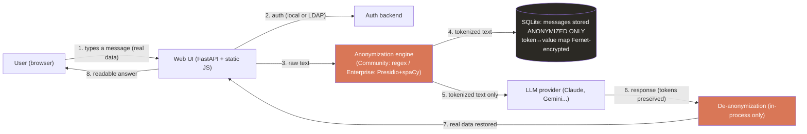

<p align="center">
  
</p>

<h1 align="center">TokenVeil — Community Edition</h1>

<p align="center">
  <a href="LICENSE"></a>
  <a href="../../releases"></a>
  <a href="Dockerfile"></a>
</p>

A self-hosted chat interface for Claude, Gemini, Vertex AI, Bedrock, OpenAI, and Mistral that automatically **anonymizes sensitive data before it reaches the LLM** (PII, internal IPs, API keys/secrets, IBANs, credit cards, customer references...), and transparently restores the real values in the response shown to the user. **The real data never leaves your infrastructure.**

This repository is the **Community Edition**: fully runnable, source-available, and free to self-host. Clone it, `docker compose up`, and you have a working private AI proxy in a couple of minutes.

> 🇫🇷 Version française : [README.fr.md](README.fr.md)

> Not affiliated with, endorsed by, or sponsored by Anthropic or Google. "Claude" is a trademark of Anthropic PBC, "Gemini" a trademark of Google LLC. This project is an independent client that uses these models through each user's own subscription/API access.

---

## Try it in 60 seconds

```bash
git clone https://github.com/Joopinhontas/tokenveil-oss.git
cd tokenveil-oss
cp .env.example .env          # then set ANON_DB_KEY + a WEBAPP_USERS login (see the file)
docker compose up -d --build  # light build: no ML models to download
```

Open **http://localhost:8500**, log in, link an AI account (a free Gemini API key from aistudio.google.com is the quickest), and paste a log full of IPs, emails and API keys. Watch them get tokenized before they reach the model, and restored in the answer.

Prefer the terminal? Measure the anonymizer directly:

```bash
pip install -r requirements.txt
python3 tools/fuzz_anon.py --n 3000   # random synthetic PII, reports the leak rate
```

---

## Community vs Enterprise

TokenVeil ships in two editions that share the **exact same product** (UI, auth, providers, storage, Docker) and differ only in the **detection engine** behind one interface (`anon_engine.py`).

| | **Community** (this repo) | **Enterprise** (commercial) |
|---|---|---|
| Engine | Regex-based, dependency-free | Microsoft Presidio + spaCy NER (fr/en) + ML |
| Install | Seconds, runs anywhere | Bundles ~1 GB language models |
| Emails, IPs, MACs, IBANs, cards, phones, secrets | ✅ | ✅ |
| API keys / tokens / passwords (AWS, GitHub, Stripe, JWT, PEM...) | ✅ | ✅ |
| Names after a civility title (`M. Dupont`) | ✅ | ✅ |
| **Free-text names / organizations / locations** (no title, in prose) | ❌ | ✅ |
| First-name lexicon anchor, CamelCase/User-Agent/query-param heuristics | ❌ | ✅ |
| Measured leak rate | ~0% on the deterministic categories | **0%** over 3,340+ values incl. free-text names ([benchmark](https://tokenveil.eu/benchmark)) |
| Support & license | Self-serve, ELv2 | Commercial license + support |

The Community engine is genuinely useful and lets you evaluate the whole product. The Enterprise engine is where the accuracy on hard, real-world cases (a customer name buried in a stack trace, an org in free prose) comes from. It drops in behind the same interface — nothing else in the codebase changes.

**Enterprise / commercial license:** [contact@tokenveil.eu](mailto:contact@tokenveil.eu)

---

## How it works



**The real values never cross the network boundary to the model.** Tokenization happens server-side, in-process, before the outbound call. De-tokenization happens after the response, also in-process. The provider only ever sees tokenized text in and tokenized text out.

### Per-user Claude billing (no shared API key)

Each user can link **their own** Claude Pro/Max subscription via an in-app OAuth flow. The backend drives `claude setup-token` (the official Claude Code CLI command) through a pseudo-terminal, captures the long-lived OAuth token, and stores it Fernet-encrypted on disk, isolated per user. Prompts run against that user's own subscription, not a shared metered API key. (Gemini, OpenAI, Mistral, Vertex, Bedrock link via API key instead.)

### Live transparency

As the user types, the UI shows in real time exactly what would be sent to the model in anonymized form. Every sent message also has a "show what was sent" toggle revealing the actual tokenized payload that left the server. Nothing about the anonymization is hidden from the user.

---

## Data at rest

- **Messages**: only the *anonymized* version is stored. Real text is never persisted in plaintext.
- **Token ↔ value mapping**: per-conversation, Fernet-encrypted at rest (key from `ANON_DB_KEY`). Decrypted only in-process, to render the de-anonymized view to the authenticated owner.
- **Linked-account credentials** (OAuth tokens, API keys, the LDAP service-account password): Fernet-encrypted, file perms `600`, never logged.

## Authentication

- `AUTH_BACKEND=local`: local accounts (`WEBAPP_USERS` in `.env`, or created from the admin UI). PBKDF2-hashed.
- `AUTH_BACKEND=ldap`: bind+search against your existing LDAP/Active Directory, with optional group restriction and per-group seat quotas.

## Security

Even the Community edition ships production hardening (see [`middleware.py`](middleware.py)): a strict Content-Security-Policy with no third-party origins, anti-clickjacking headers, HSTS behind TLS, and an anti-abuse rate limiter. Sessions are random tokens, brute-force login is rate-limited per account and per IP.

## Installation

**Docker (recommended):** see [Try it in 60 seconds](#try-it-in-60-seconds) above. The `./data` folder is the only state worth backing up (SQLite DB + encrypted mapping + linked accounts); it's a mounted volume, so rebuilding to update code never touches it.

**Without Docker:**

```bash
python3 -m venv venv && source venv/bin/activate
pip install -r requirements.txt
cp .env.example .env          # set ANON_DB_KEY, WEBAPP_USERS, AUTH_BACKEND
uvicorn app:app --host 0.0.0.0 --port 8500
```

Linking a Claude subscription (not API-key providers) additionally needs the `claude` CLI on `PATH`; the Docker image installs it for you.

## Tech stack

| Layer | Choice |
|---|---|
| Backend | FastAPI (Python 3.12) |
| Frontend | Vanilla JS/HTML/CSS, no build step |
| Anonymization | **Community:** dependency-free regex engine · **Enterprise:** Presidio + spaCy NER + ML |
| Auth | Local (PBKDF2) or LDAP/AD (`ldap3`) |
| Storage | SQLite, Fernet (`cryptography`) at rest |
| Security | CSP + security headers + rate limiting (`middleware.py`) |

## License

Source-available under the [Elastic License 2.0](LICENSE). You can read, audit, self-host, and modify this code. You may **not** offer it as a hosted/managed service to third parties, or circumvent the license-key system. Commercial deployment license and the Enterprise engine: [contact@tokenveil.eu](mailto:contact@tokenveil.eu).

---

*See [ARCHITECTURE.md](ARCHITECTURE.md) for the full design, and [tokenveil.eu/benchmark](https://tokenveil.eu/benchmark) for the anonymization measurement methodology.*
