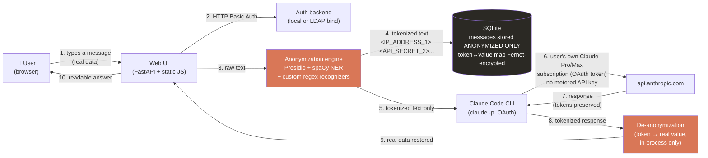

<p align="center">
  
</p>

<h1 align="center">TokenVeil</h1>

<p align="center">
  <a href="LICENSE"></a>
  <a href="../../releases"></a>
  <a href="Dockerfile"></a>
</p>

**Status: Alpha (internal test build), public showcase repository**

A self-hosted chat interface for Claude, Gemini, Vertex AI, Bedrock, OpenAI, and Mistral that automatically anonymizes sensitive data (PII, internal IPs, API keys/secrets, customer references, IBANs, credit card numbers...) before it reaches the LLM, and transparently restores the real values in the response shown to the user. The real data never leaves your infrastructure.

> **This is a showcase copy.** Everything here is real production code (auth, licensing system, frontend, Docker deployment, multi-provider AI accounts) except `anon_engine.py`, the actual anonymization/detection engine, which is replaced by a stub matching its public interface. See [ARCHITECTURE.md](ARCHITECTURE.md) §4 for what it does without exposing how. Full source available under a commercial license: [contact@tokenveil.eu](mailto:contact@tokenveil.eu).

> Not affiliated with, endorsed by, or sponsored by Anthropic or Google. "Claude" is a trademark of Anthropic PBC, "Gemini" a trademark of Google LLC. This project is an independent client that uses these models through each user's own subscription/API access.

## License

Source-available under the [Elastic License 2.0](LICENSE). You can read, audit, and self-host this code. You may **not**: offer it as a hosted/managed service to third parties, or circumvent/disable the license-key system. For a commercial deployment license, contact [contact@tokenveil.eu](mailto:contact@tokenveil.eu).

> 🇫🇷 Version française : [README.fr.md](README.fr.md)

---

## 1. The problem

Teams paste real production data into AI chat tools every day: logs with internal IPs, leaked API keys, customer names, ticket references, financial data. That data is then sent to a third-party model provider, stored on their side, and potentially used for training or retained in logs.

**TokenVeil** sits between your team and Claude: it strips out anything sensitive *before* the request leaves your server, and puts it back *after* the response comes in. From the user's point of view, nothing changes. They paste a real log, they get a real, actionable answer back. Claude itself only ever sees opaque placeholders like `<IP_ADDRESS_1>`, `<API_SECRET_2>`, `<CUSTOMER_REF_3>`.

## 2. How it works



**Key point: the real values never cross the network boundary to Claude.** Tokenization happens server-side, in-process, before the outbound call. De-tokenization happens after the response is received, also in-process. Anthropic's API only ever sees steps 5 to 7: tokenized text in, tokenized text out.

### Per-user Claude billing (no shared API key)

Each user links **their own** Claude Pro/Max subscription via an in-app OAuth flow (Profile page → "Link my Claude account"). The backend drives `claude setup-token` (the official Claude Code CLI command) through a pseudo-terminal, captures the resulting long-lived OAuth token, and stores it Fernet-encrypted on disk, isolated per user (`CLAUDE_CONFIG_DIR` per username). Every prompt for that user is then executed via the Claude Code CLI authenticated with their own token: **billed against their personal subscription, not a shared, metered API key.**

### What gets detected and anonymized

| Category | Examples |
|---|---|
| Network | IPv4 addresses, MAC addresses, internal hostnames (`.local`, `.corp`, `.lan`...) |
| Identity | Person names, emails, phone numbers, `user=`/`login=`/`owner=` style log fields |
| Secrets | API keys, tokens, passwords, bearer tokens (`apikey=...`, `token: ...`), bare high-entropy hex/base64 strings |
| Financial | IBANs, credit card numbers |
| Business refs | Customer/ticket/employee references (`CUST-1234`, `TICKET-5678`...) |
| Generic NER | Organizations, locations, US SSN (via spaCy, FR + EN) |

Detection combines:
- **Presidio's built-in recognizers** (NER-backed, via spaCy `fr_core_news_lg` / `en_core_web_lg`)
- **Custom regex recognizers** tuned for technical/log formats that generic NER misses (raw API keys, IPs inside URLs, IBANs without checksum validation that would otherwise leak on a typo, etc.)
- **Overlap resolution** prioritizing high-confidence custom patterns over generic NER guesses, line-by-line processing to prevent entity bleed across log lines.

### Live transparency

The UI shows, in real time as the user types, exactly what would be sent to Claude in anonymized form (debounced preview). Every sent message also has a "Show what was sent to Claude" toggle revealing the actual tokenized payload that left the server. Nothing is hidden from the end user about what anonymization is actually doing.

## 3. Data at rest

- **Conversations table**: stores only the *anonymized* version of every message. The real text is never persisted in plaintext.
- **Token ↔ value mapping**: stored per-conversation, encrypted at rest with Fernet (symmetric, key from `ANON_DB_KEY` env var). Decrypted only in-process, on demand, to render the de-anonymized view to the authenticated owner.
- **OAuth tokens**: stored per-user, Fernet-encrypted, file permissions `600`, never logged, never sent anywhere except as an environment variable to the local `claude` CLI process.

## 4. Authentication

- `AUTH_BACKEND=local`: single shared user/password from `.env` (suitable for a quick alpha test).
- `AUTH_BACKEND=ldap`: bind+search against your existing LDAP/Active Directory. Supports service-account search-then-bind (AD-compatible) or direct DN templating, plus optional group-membership restriction (`LDAP_REQUIRE_GROUP_DN`).

This is the foundation for the target multi-user model: employees authenticate via the company's existing LDAP, then each links their own Claude Pro/Max subscription once, in the UI.

## 5. Installation

### 5.1 Docker (recommended for customer deployments)

```bash
cp .env.example .env
# fill in ANON_DB_KEY (generate with the command commented in the file),
# AUTH_BACKEND, WEBAPP_USERS (or LDAP_*)

docker compose up -d --build
```

The image bundles everything: Python, French/English spaCy models, Node.js, and the Claude Code CLI
(`claude`). First build is slow (~1 GB of NLP models to download), later ones are fast thanks to Docker's
layer cache.

**The `./data` folder is the only state worth backing up**: SQLite database (conversations, encrypted
mapping), linked Claude/Gemini accounts per user. It's mounted as a volume, so `docker compose up --build`
to update the code never touches it. No backup means losing account links and history if the container
is removed.

Check it's running:
```bash
curl http://localhost:8500/healthz   # {"status": "ok"}
```

### 5.2 Without Docker (local dev)

```bash
python3 -m venv venv
source venv/bin/activate
pip install -r requirements.txt

cp .env.example .env   # fill in WEBAPP_USER / WEBAPP_PASSWORD / ANON_DB_KEY / AUTH_BACKEND
uvicorn app:app --host 0.0.0.0 --port 8500
```

Requirements in this case: `claude` (Claude Code CLI) installed and on `PATH` manually (the Docker image
handles this automatically). Each user links their own subscription from the **Preferences** panel in
the web UI. No API key needed for Claude; Gemini links via a personal API key (aistudio.google.com),
free on Flash models.

## 6. Tech stack

| Layer | Choice |
|---|---|
| Backend | FastAPI (Python) |
| Frontend | Vanilla JS/HTML/CSS, no build step |
| Anonymization | Microsoft Presidio (analyzer + anonymizer) + spaCy NER + custom Pattern recognizers |
| Auth | HTTP Basic, local or LDAP (`ldap3`) |
| Storage | SQLite, Fernet (`cryptography`) for encryption at rest |
| Claude access | Claude Code CLI, OAuth (`claude setup-token`), per-user subscription |

## 7. Alpha scope & roadmap

This build validates the core mechanism end-to-end: real homelab logs (leaked API keys, internal/public IPs, resource IDs) were run through the pipeline and verified at the raw-database level to confirm zero plaintext leakage. Known next steps:
- Strict per-user conversation isolation (currently legacy/unowned conversations are visible to all users)
- Configurable entity allow/deny list per deployment
- Audit log of anonymization decisions for compliance review
- Multi-tenant LDAP group-based access policies

---

*Internal alpha, built for evaluation, not yet hardened for production multi-tenant deployment.*
